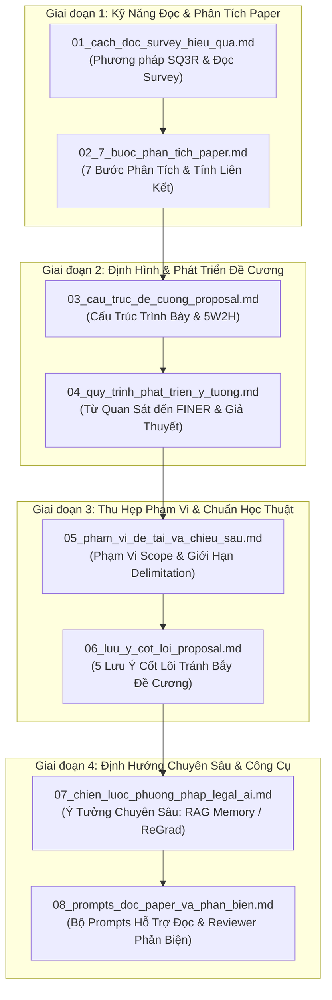

---
{"dg-publish":true,"permalink":"/knowledge/02-tech-second-brain/research-skills/mindset-read-paper/00-huong-dan-doc/","pinned":"false","tags":["type/howto","topic/research-method","topic/legal-ai","status/stable"]}
---

# 📚 HƯỚNG DẪN ĐỌC VÀ LỘ TRÌNH NGHIÊN CỨU (REFERENCE MINDSET)

> **Mục tiêu:** Thư mục `Mindset_read_paper` chứa đựng các tài liệu phương pháp luận, tư duy chuẩn bị đề cương nghiên cứu (Research Proposal), kỹ năng đọc/phân tích bài báo khoa học và định hướng ứng dụng cho bài toán Legal AI (LLM / RAG / Continual Learning).

---

## 🗺️ Sơ Đồ Lộ Trình Đọc Tài Liệu (Reading Roadmap)

Để đạt hiệu quả tối đa, bạn nên tuân theo lộ trình 4 bước được hệ thống hóa dưới đây:

---

## 📑 Danh Mục & Tóm Tắt Chi Tiết Các Tài Liệu

### 1. Kỹ Năng Đọc & Phân Tích (Files 01 - 02)
* 📄 [01_cach_doc_survey_hieu_qua](01_cach_doc_survey_hieu_qua.md)
  * **Nội dung:** Hướng dẫn đọc bài báo tổng quan (survey) theo phương pháp SQ3R (Survey, Question, Read, Recite, Review), cách đọc theo tầng và template ghi chú 1 trang dành riêng cho mảng Legal LLM / Continual Learning.
  * **Khi nào đọc:** Khi mới bắt đầu tìm hiểu một lĩnh vực mới hoặc cần đọc lướt hàng chục survey để xây dựng taxonomy.

* 📄 [02_7_buoc_phan_tich_paper](02_7_buoc_phan_tich_paper.md)
  * **Nội dung:** Khung 7 bước phân tích chuyên sâu bài báo khoa học qua 3 giai đoạn (Đánh giá tổng thể -> Chất vấn -> Phán quyết) và phân tích tính liên kết logic giữa Đề cương với Nghiên cứu thực tế.
  * **Khi nào đọc:** Khi cần phân tích kỹ một bài báo lõi (core paper) để tìm khoảng trống nghiên cứu (research gap).

---

### 2. Định Hình & Quy Trình Phát Triển Đề Cương (Files 03 - 04)
* 📄 [03_cau_truc_de_cuong_proposal](03_cau_truc_de_cuong_proposal.md)
  * **Nội dung:** Quy chuẩn hình thức trình bày và cấu trúc 5W2H (What, Why, When, Where, Who, How, How much) của một Đề cương nghiên cứu (Research Proposal) hoàn chỉnh.
  * **Khi nào đọc:** Khi bắt đầu đặt bút dựng khung đề cương chi tiết.

* 📄 [04_quy_trinh_phat_trien_y_tuong](04_quy_trinh_phat_trien_y_tuong.md)
  * **Nội dung:** Quy trình 6 bước biến quan sát thực tiễn thành tên đề tài và mục tiêu cụ thể thông qua bộ tiêu chí FINER (Feasible, Interesting, Novel, Ethical, Relevant) và xây dựng Giả thuyết nghiên cứu.
  * **Khi nào đọc:** Khi chưa có đề tài rõ ràng, cần tìm kiếm và sàng lọc ý tưởng nghiên cứu.

---

### 3. Phạm Vi & Hoàn Thiện Chuẩn Học Thuật (Files 05 - 06)
* 📄 [05_pham_vi_de_tai_va_chieu_sau](05_pham_vi_de_tai_va_chieu_sau.md)
  * **Nội dung:** Phân tích chuyên sâu tại sao thu hẹp phạm vi lại dẫn đến chiều sâu học thuật. Phân biệt Scope (Phạm vi) và Delimitation (Giới hạn), quy trình thu hẹp đề tài theo thời gian và nguồn lực thực tế của Luận văn Thạc sĩ.
  * **Khi nào đọc:** Khi đề tài bị nhận xét là "quá rộng", "quá tham vọng", hoặc khi chuẩn bị bảo vệ đề cương trước Hội đồng.

* 📄 [06_luu_y_cot_loi_proposal](06_luu_y_cot_loi_proposal.md)
  * **Nội dung:** 5 lưu ý cốt lõi tránh bẫy đề cương (Phân biệt Proposal vs Literature Review, Mục tiêu vs Lý do, Methodology thực chất, Liêm chính học thuật khi dùng AI).
  * **Khi nào đọc:** Khi đã viết xong bản nháp đề cương, cần rà soát lại để tăng tính thuyết phục trước người phản biện.

---

### 4. Định Hướng Chuyên Sâu & Công Cụ Hỗ Trợ (Files 07 - 08)
* 📄 [07_chien_luoc_phuong_phap_legal_ai](07_chien_luoc_phuong_phap_legal_ai.md)
  * **Nội dung:** Phân tích các hướng đi phương pháp (Method Paper) tiềm năng cho bài toán Legal AI: Selective Legal RAG Memory với cơ chế quên (forgetting curve), Semi-parametric Continual Learning (ReGrad), và Machine Unlearning cho văn bản luật.
  * **Khi nào đọc:** Khi chọn hướng kỹ thuật chính (methodology) cho bài toán Vietnam Legal LLM / RAG.

* 📄 [08_prompts_doc_paper_va_phan_bien](08_prompts_doc_paper_va_phan_bien.md)
  * **Nội dung:** Bộ Prompt AI đóng vai Reviewer phản biện (NeurIPS/ICLR format), Prompt tóm tắt từng phần theo cấu trúc, và Prompt thiết kế trực quan hóa số liệu thực nghiệm (Data & Metrics view).
  * **Khi nào đọc:** Khi dùng các công cụ LLM (NotebookLM, ChatGPT, Gemini, Perplexity) để đọc paper và kiểm thử tính chắc chắn của lập luận bài báo.

---

## ⚡ Bảng Tra Cứu Nhanh Theo Nhu Cầu

| Bạn đang gặp vấn đề gì? | File cần đọc ngay |
| :--- | :--- |
| **"Tôi chưa biết bắt đầu đọc các bài báo Survey từ đâu"** | 📄 [01_cach_doc_survey_hieu_qua](01_cach_doc_survey_hieu_qua.md) |
| **"Tôi muốn đọc kỹ 1 paper chính để trích xuất điểm yếu/gap"** | 📄 [02_7_buoc_phan_tich_paper](02_7_buoc_phan_tich_paper.md) & [08_prompts_doc_paper_va_phan_bien](08_prompts_doc_paper_va_phan_bien.md) |
| **"Tôi cần viết khung Đề cương chuẩn 5W2H"** | 📄 [03_cau_truc_de_cuong_proposal](03_cau_truc_de_cuong_proposal.md) |
| **"Tôi có ý tưởng ban đầu nhưng chưa biết đánh giá tính khả thi"** | 📄 [04_quy_trinh_phat_trien_y_tuong](04_quy_trinh_phat_trien_y_tuong.md) |
| **"Hội đồng bảo rằng tên đề tài của tôi quá rộng"** | 📄 [05_pham_vi_de_tai_va_chieu_sau](05_pham_vi_de_tai_va_chieu_sau.md) |
| **"Tôi muốn kiểm tra lại tính thuyết phục của bản Proposal"** | 📄 [06_luu_y_cot_loi_proposal](06_luu_y_cot_loi_proposal.md) |
| **"Tôi cần gợi ý Novelty/Method cho đề tài Legal AI"** | 📄 [07_chien_luoc_phuong_phap_legal_ai](07_chien_luoc_phuong_phap_legal_ai.md) |
