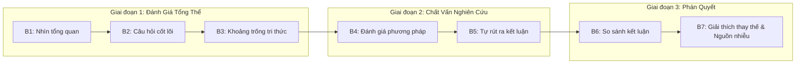
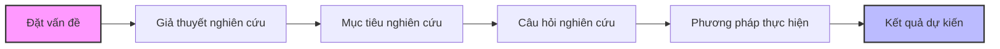

---
{"dg-publish":true,"permalink":"/knowledge/02-tech-second-brain/research-skills/mindset-read-paper/02-7-buoc-phan-tich-paper/","pinned":"false","tags":["type/howto","topic/research-method","status/stable"]}
---

# 🔬 7 BƯỚC PHÂN TÍCH BÀI BÁO KHOA HỌC & TÍNH LIÊN KẾT ĐỀ CƯƠNG

> **Tóm tắt:** Đọc một bài báo nghiên cứu đòi hỏi chiến lược 3 giai đoạn (Đánh giá tổng thể -> Chất vấn -> Phán quyết) nhằm đánh giá lập luận, kiểm chứng dữ liệu và hình thành nhận định độc lập. Đồng thời, bài viết làm rõ tính liên kết chặt chẽ giữa Đề cương và Nghiên cứu khoa học thực tế.

---

## 📑 PHẦN I: KHUNG PHÂN TÍCH BÀI BÁO KHOA HỌC 7 BƯỚC

### 📍 Giai Đoạn 1 — Đánh Giá Tổng Thể (Overview)

#### Bước 1: Có cái nhìn tổng quan về nghiên cứu
* Đọc lướt phần Tóm tắt (Abstract), sau đó xem các hình vẽ (Figures) và bảng biểu (Tables) để xác định loại nghiên cứu, phạm vi và các phương pháp chính được sử dụng.
* Nắm bắt bức tranh tổng thể giúp định hình ngữ cảnh trước khi đi vào chi tiết kỹ thuật.

#### Bước 2: Xác định câu hỏi nghiên cứu cốt lõi
* Xác định câu hỏi hoặc giả thuyết trung tâm (thường nằm ở đoạn cuối phần *Introduction*).
* Đánh giá xem toàn bộ thiết kế thí nghiệm của bài báo có tập trung trả lời câu hỏi này hay không.

#### Bước 3: Xác định khoảng trống tri thức (Research Gap)
* Phân tích phần Giới thiệu để hiểu bối cảnh khoa học: *Đã biết điều gì? Chưa rõ điều gì? Tại sao việc giải quyết khoảng trống đó lại quan trọng?*

---

### 📍 Giai Đoạn 2 — Chất Vấn Nghiên Cứu (Interrogation)

#### Bước 4: Đánh giá phương pháp nghiên cứu (Methodology)
* Kiểm tra thiết kế nghiên cứu: Mô hình có phù hợp? Cỡ mẫu đủ lớn? Thống kê đủ mạnh? Có nhóm đối chứng (baseline) công bằng không?
* Đánh giá tính minh bạch: Tác giả có công khai mã nguồn (code), dữ liệu thô (raw data) và thiết lập môi trường để tái lập kết quả (reproducibility) không?

#### Bước 5: Tự rút ra kết luận từ dữ liệu
* **Tự phân tích trước:** Trực tiếp soi các đồ thị, bảng biểu thực nghiệm và tự rút ra kết luận độc lập *trước khi* đọc phần Thảo luận (Discussion) của tác giả.

---

### 📍 Giai Đoạn 3 — Phán Quyết (Verdict)

#### Bước 6: So sánh kết luận bản thân với kết luận của tác giả
* Đối chiếu xem diễn giải của tác giả có bám sát dữ liệu không, có hiện tượng cường điệu hóa kết quả (overclaiming) hoặc kết luận vượt quá bằng chứng thu được hay không.

#### Bước 7: Xem xét các giải thích thay thế & Yếu tố gây nhiễu
* Đánh giá hạn chế của nghiên cứu: Các yếu tố nhiễu tiềm tàng, các cách giải thích khác cho kết quả, xung đột lợi ích (conflict of interest).
* Một công trình uy tín luôn minh bạch về những hạn chế của chính mình.

---

## 🔗 PHẦN II: MỤC TIÊU & TÍNH LIÊN KẾT TRONG ĐỀ CƯƠNG NGHIÊN CỨU

Đề cương nghiên cứu (Research Proposal) không phải là một văn bản hành chính đơn thuần, mà là **bản thiết kế kiến trúc** cho toàn bộ quá trình nghiên cứu khoa học. Theo các học giả phương pháp luận (như RUG), một đề cương chất lượng cao bắt buộc phải đảm bảo **tính liên kết logic chặt chẽ** giữa các thành phần:

### 3 Trục Liên Kết Logic Cốt Lõi:

1. **Đặt vấn đề ➔ Giả thuyết ➔ Mục tiêu ➔ Câu hỏi nghiên cứu:**
   * Tạo thành một chuỗi suy luận liên tục, dẫn dắt người đọc đi từ bối cảnh thực tiễn đến giả thuyết khoa học và câu hỏi cụ thể cần giải đáp.
2. **Mục tiêu ➔ Giả thuyết ➔ Phương pháp:**
   * Mục tiêu phải bao gồm 3 khía cạnh: *Bao quát, Cụ thể, Thực hiện được*.
   * Giả thuyết là phát biểu mang tính tiên đoán. Phương pháp phải được thiết kế để kiểm định giả thuyết đó một cách khách quan và chính xác.
3. **Giả thuyết ➔ Mục tiêu ➔ Kết quả mong muốn:**
   * Phải thể hiện sự nhất quán 1:1. Mỗi kết quả dự kiến phải tương ứng trực tiếp với một mục tiêu cụ thể và một giả thuyết đã đặt ra.

> 💡 **Lưu ý thực tiễn:** Đề cương cần phản ánh đúng thực trạng nghiên cứu. Ví dụ trong mảng AI/Luật: *"Các nghiên cứu hiện tại thường xử lý bề rộng theo chiều ngang (QA đơn giản) mà chưa đi vào chiều sâu (temporal law conflict, catastrophic forgetting trong continual learning)"*. Nhận diện đúng thực trạng này sẽ định hình mục tiêu nghiên cứu sắc bén hơn.
