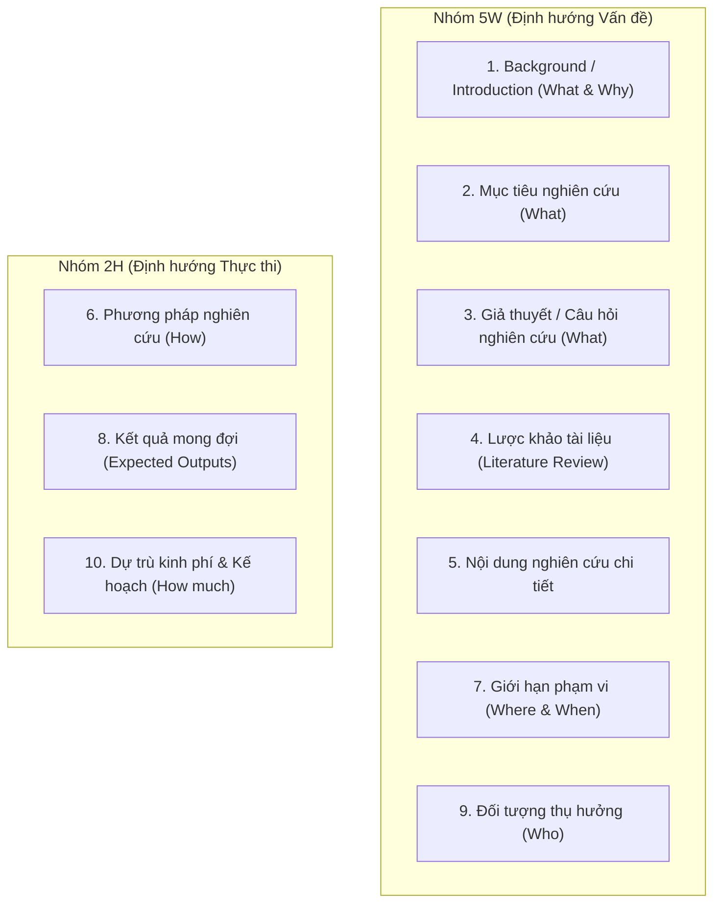

---
{"dg-publish":true,"permalink":"/knowledge/02-tech-second-brain/research-skills/mindset-read-paper/03-cau-truc-de-cuong-proposal/","pinned":"false","tags":["type/howto","topic/research-method","status/stable"]}
---

# 📐 CẤU TRÚC ĐỀ CƯƠNG NGHIÊN CỨU (RESEARCH PROPOSAL)

> **Tóm tắt:** Đề cương nghiên cứu (Research Proposal) là "bản vẽ thi công" khoa học nhằm thuyết phục nhà quản lý, người hướng dẫn hoặc hội đồng chuyên môn. Một đề cương chuẩn chỉnh vừa phải đảm bảo hình thức quy chuẩn, vừa phải bám sát cấu trúc nội dung cốt lõi **5W2H**.

---

## 📑 1. Quy Chuẩn Trình Bày Hình Thức (Format Completeness)

Trước khi đi vào nội dung chuyên môn, đề cương cần tuân thủ cấu trúc trình bày theo thứ tự chuẩn mực:

1. **Trang bìa:** Tên cơ sở đào tạo / cơ quan quản lý, Tên đề tài, Chuyên ngành, Người hướng dẫn khoa học, Người thực hiện, Thời gian và Địa điểm hoàn thành.
2. **Lời cảm tạ / Lời cam đoan** (nếu có).
3. **Tóm tắt đề cương (Executive Summary):** 200 - 300 từ tóm lược bối cảnh, mục tiêu, phương pháp và đóng góp dự kiến.
4. **Mục lục.**
5. **Danh mục các phần bổ trợ:** Danh mục sơ đồ / hình vẽ, Danh mục bảng biểu, Danh mục các từ viết tắt.

---

## 🎯 2. Cấu Trúc Nội Dung Cốt Lõi Theo Công Thức 5W2H

Nội dung chính của đề cương được phát triển dựa trên công thức **5W2H** (*What, Why, When, Where, Who, How, How much*), bao gồm **10 mục trọng tâm** và phần Tài liệu tham khảo:

### Chi tiết 10 mục trọng tâm:

1. **Giới thiệu (Background / Introduction) — `[What & Why]`:**
   * Nêu bối cảnh thực tiễn, tính cấp thiết và lý do lựa chọn đề tài. Trả lời câu hỏi: *Nghiên cứu cái gì? Tại sao nghiên cứu?*
2. **Mục tiêu nghiên cứu (Research Objectives) — `[What]`:**
   * Trình bày phân biệt rõ **Mục tiêu chung** (General Objective) và các **Mục tiêu cụ thể** (Specific Objectives).
3. **Giả thuyết & Câu hỏi nghiên cứu (Hypotheses / Research Questions) — `[What]`:**
   * Phát biểu các suy đoán khoa học có cơ sở chờ được kiểm chứng thực nghiệm.
4. **Lược khảo tài liệu (Literature Review):**
   * Tổng quan tổng hợp các nghiên cứu đi trước, chỉ ra thành tựu đã đạt được và khoảng trống tri thức còn bỏ ngỏ.
5. **Nội dung nghiên cứu (Research Content):**
   * Liệt kê chi tiết các công việc, các phần nội dung cần triển khai để đạt được từng mục tiêu cụ thể.
6. **Phương pháp nghiên cứu (Methodology) — `[How]`:**
   * Mô tả phương pháp luận, kiến trúc mô hình, thu thập dữ liệu, kỹ thuật xử lý và tiêu chí đánh giá.
7. **Giới hạn phạm vi nghiên cứu (Scope & Delimitations) — `[Where & When]`:**
   * Xác định rõ giới hạn về nội dung, đối tượng, không gian và thời gian triển khai.
8. **Kết quả mong đợi (Expected Results):**
   * Mô tả cụ thể các sản phẩm khoa học / thực tiễn thu được tương ứng với từng mục tiêu cụ thể.
9. **Đối tượng thụ hưởng (Beneficiaries) — `[Who]`:**
   * Chỉ rõ ai (cá nhân, tổ chức, cộng đồng nghiên cứu) sẽ được hưởng lợi từ kết quả của đề tài.
10. **Dự trù kinh phí & Kế hoạch triển khai — `[How much]`:**
    * Bảng ước tính ngân sách (nhân lực, hạ tầng tính toán, dữ liệu...) và biểu đồ tiến độ (Gantt chart).
* **Tài liệu tham khảo (References):** Trình bày theo chuẩn trích dẫn quốc tế (IEEE, APA,...).

---

## 💡 3. Lưu Ý Điều Chỉnh Đề Cương Tại Việt Nam

Tại các Hội đồng học thuật và Cơ quan quản lý tại Việt Nam, cấu trúc đề cương thường được tinh chỉnh dưới các mục tiêu đề tiêu chuẩn sau:

* 📌 **Mục I:** Tính cấp thiết và Tổng quan tình hình nghiên cứu.
* 📌 **Mục II:** Mục tiêu và Đối tượng / Phạm vi nghiên cứu.
* 📌 **Mục III:** Nội dung, Phương pháp nghiên cứu và Kỹ thuật sử dụng.
* 📌 **Mục IV:** Tiến độ thực hiện, Kế hoạch triển khai & Hợp tác (nếu có).
* 📌 **Mục V:** Sản phẩm dự kiến, Yêu cầu khoa học & Địa chỉ ứng dụng kết quả.
