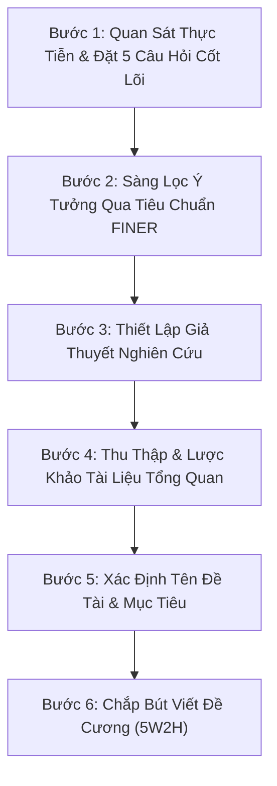

---
{"dg-publish":true,"permalink":"/knowledge/02-tech-second-brain/research-skills/mindset-read-paper/04-quy-trinh-phat-trien-y-tuong/","pinned":"false","tags":["type/howto","topic/research-method","status/stable"]}
---

# 💡 QUY TRÌNH PHÁT TRIỂN Ý TƯỞNG NGHIÊN CỨU & ĐỀ CƯƠNG

> **Tóm tắt:** Trước khi viết đề cương chi tiết, nhà nghiên cứu cần trải qua quy trình 6 bước từ quan sát thực tiễn, đặt câu hỏi, kiểm định qua bộ tiêu chuẩn FINER, xây dựng giả thuyết đến chốt tên đề tài. Đề cương chính là "bản vẽ thi công" chuyển hóa ý tưởng thành kế hoạch thực thi logic.

---

## 🔄 Quy Trình 6 Bước Phát Triển Ý Tưởng Đến Đề Cương

---

### 👁️ Bước 1: Phát hiện vấn đề nghiên cứu qua "Quan sát" & "Đặt câu hỏi"
Mọi nghiên cứu khoa học có giá trị đều bắt nguồn từ việc quan sát thực tiễn. Đặt ra 5 câu hỏi cốt lõi để phát triển ý tưởng ban đầu:

1. **Hiện trạng:** Vấn đề thực tế đang diễn ra như thế nào? Mức độ nghiêm trọng ra sao?
2. **Nguyên nhân:** Đâu là các nguyên nhân chính gây ra vấn đề này?
3. **Nhân tố tác động:** Các nhân tố nào đang ảnh hưởng và mức độ tác động ra sao?
4. **Giải pháp hiện có:** Đã có những phương pháp/giải pháp nào? Hạn chế của chúng là gì?
5. **Ý tưởng mới:** Giải pháp/ý tưởng mới của bạn là gì? Có tính khả thi không?

---

### 🎯 Bước 2: Sàng lọc ý tưởng qua bộ tiêu chuẩn FINER
Không chọn đề tài cảm tính. Ý tưởng phát hiện từ Bước 1 phải được đánh giá qua tiêu chí **FINER** (cần đạt tối thiểu 3/5 tiêu chí):

| Tiêu chí | Khái niệm | Ý nghĩa trong đánh giá |
| :--- | :--- | :--- |
| **F**easibility | **Khả thi** | Có thể thực hiện được trong thời gian, ngân sách và nguồn lực thực tế không? |
| **I**nteresting | **Thú vị** | Có tạo được sự quan tâm cho bản thân và cộng đồng khoa học không? |
| **N**ovelty | **Mới mẻ** | Có đóng góp tri thức mới, phương pháp mới hoặc góc nhìn mới không? |
| **E**thics | **Đạo đức** | Có đảm bảo liêm chính học thuật, không vi phạm đạo đức nghiên cứu không? |
| **R**elevant | **Liên đới** | Có phù hợp với bối cảnh thực tiễn và định hướng phát triển ngành không? |

---

### 🧪 Bước 3: Thiết lập Giả thuyết nghiên cứu (Research Hypothesis)
Từ câu hỏi nghiên cứu được sàng lọc tốt ở Bước 2, đưa ra phát biểu mang tính tiên đoán (suy đoán khoa học) về mối quan hệ giữa các đối tượng/biến số. Giả thuyết này sẽ là mục tiêu cần kiểm chứng thực nghiệm trong quá trình nghiên cứu.

---

### 📚 Bước 4: Thu thập và tổng quan tài liệu (Literature Review)
Trước khi chốt phương pháp, bắt buộc phải trả lời được câu hỏi:
> *"Trong vấn đề này, các nghiên cứu đi trước (đồng nghiệp quốc tế/trong nước) đã làm được những gì và dừng lại ở đâu?"*

Việc tổng quan giúp tránh lặp lại công việc người khác đã làm và khẳng định tính Novelty của đề tài.

---

### 🏷️ Bước 5: Xác định Tên đề tài và Mục tiêu nghiên cứu
Khi ý tưởng và tri thức đã chín muồi:

* **Tên đề tài:** Cần ngắn gọn, súc tích, phản ánh rõ mục tiêu chung, đối tượng nghiên cứu, không gian và thời gian thực hiện.
* **Mục tiêu nghiên cứu:** Xác định rõ mục tiêu tổng quát và danh sách mục tiêu cụ thể (nhằm trả lời trực tiếp câu hỏi *"Nghiên cứu cái gì?"*).

---

### 📝 Bước 6: Chắp bút viết Đề cương nghiên cứu
Khi đã trang bị đầy đủ *Vấn đề - Câu hỏi - Giả thuyết - Mục tiêu - Tài liệu đi trước*, tiến hành viết đề cương chi tiết theo khung **5W2H** (gồm 10 mục tiêu chuẩn). Quá trình viết ra trang giấy giúp hệ thống hóa lại tư duy và phát hiện sớm các điểm thiếu logic trong thiết kế nghiên cứu.
