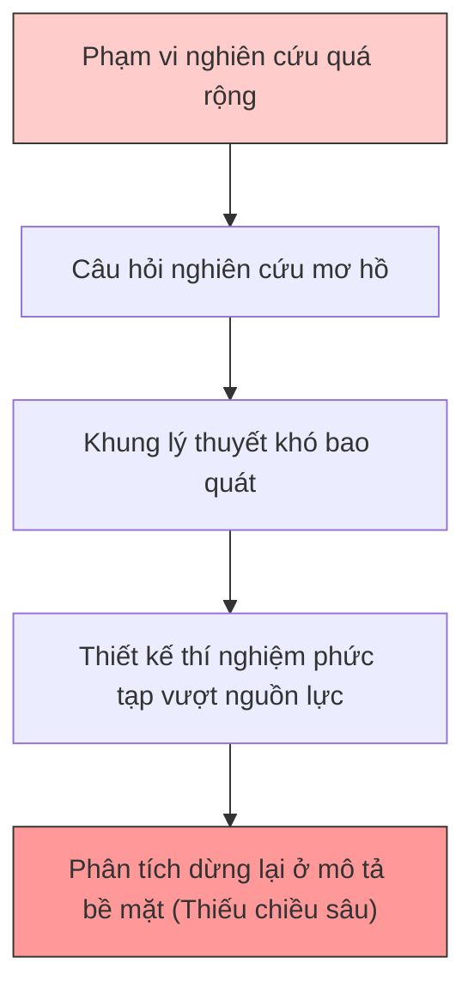
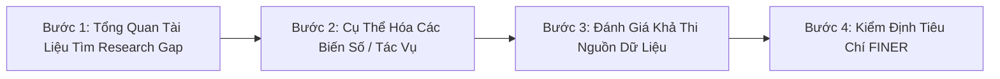

---
{"dg-publish":true,"permalink":"/knowledge/02-tech-second-brain/research-skills/mindset-read-paper/05-pham-vi-de-tai-va-chieu-sau/","pinned":"false","tags":["type/howto","topic/research-method","status/stable"]}
---

# 🎯 PHẠM VI ĐỀ TÀI & CHIỀU SÂU HỌC THUẬT IN RESEARCH PROPOSALS

> **Tóm tắt:** Việc thu hẹp phạm vi đề tài (Narrowing Scope) không phải là sự từ bỏ tham vọng khoa học, mà là yêu cầu bắt buộc mang tính phương pháp luận. Trong khoa học, giá trị nghiên cứu được đo bằng chiều sâu của phân tích và tính chính xác của bằng chứng, không đo bằng quy mô vĩ mô của vấn đề.

---

## 🛑 1. Nghịch Lý Của Phạm Vi Rộng (The Broad Scope Paradox)

### Khi Tham Vọng Va Chạm Thực Tế Phản Biện
Một tình huống diễn ra phổ biến trước Hội đồng bảo vệ đề cương: Học viên chọn đề tài vĩ mô như *"Tác động của AI và Chuyển đổi số tới toàn bộ hệ thống pháp luật quốc gia"*. Khi hội đồng chất vấn về nguồn dữ liệu, thời gian thu thập, thiết kế thực nghiệm và mô hình kiểm định trong 6-12 tháng, học viên hoàn toàn lúng túng.

### 3 Lý Do Hàng Đầu Khiến Đề Cương Bị Từ Chối:
1. **Phạm vi quá rộng:** Cố gắng giải quyết quá nhiều vấn đề cùng một lúc.
2. **Sự mất kết nối:** Phương pháp nghiên cứu không khớp với câu hỏi đặt ra.
3. **Lược khảo tài liệu nông:** Dưới 30 nguồn nghiên cứu cập nhật gần nhất.

---

## ⏳ 2. Khung Thời Gian Thực Tế Luận Văn Thạc Sĩ

Đề tài cần được thiết kế dựa trên nguồn lực và thời gian thực tế:

* **Thời gian thực hiện tiêu chuẩn:** 6 - 12 tháng từ khi duyệt đề cương (theo chuẩn Harvard Extension School, Rutgers, và các đại học Châu Âu).
* **Các công việc phải hoàn thành:** Tổng quan tài liệu sâu -> Thiết kế nghiên cứu -> Thu thập & làm sạch dữ liệu -> Huấn luyện/Đánh giá mô hình -> Viết bản thảo -> Chỉnh sửa theo phản hồi -> Bảo vệ.
* **Hàm ý phương pháp luận:** Giới hạn thời gian không phải là trở ngại ngoài ý muốn, mà là **điều kiện cố định** của bối cảnh nghiên cứu. Đề tài phải được thiết kế khả thi trong khung thời gian này.

---

## 🔍 3. Phân Biệt Scope (Phạm Vi) và Delimitations (Giới Hạn)

| Khái niệm | Định nghĩa | Bản chất khoa học |
| :--- | :--- | :--- |
| **Phạm vi (Scope)** | Tổng thể ranh giới mà nghiên cứu bao quát (đối tượng, không gian, thời gian). | Định vị nghiên cứu nằm ở đâu. |
| **Giới hạn (Delimitations)** | Quyết định chủ động của nhà nghiên cứu về những gì sẽ **loại trừ** và lý do loại trừ. | Sự lựa chọn phương pháp luận có chủ đích (cần biện minh, không cần xin lỗi). |
| **Hạn chế (Limitations)** | Các yếu tố khách quan nằm ngoài tầm kiểm soát của tác giả (ví dụ: cỡ mẫu rủi ro, rào cản truy cập API). | Yếu tố khách quan cần minh bạch thừa nhận. |

> 💡 **Ví dụ minh họa:**
> * ❌ **Phạm vi quá rộng:** *"Ảnh hưởng của thương mại điện tử tới hành vi tiêu dùng tại Việt Nam"*.
> * ✅ **Phạm vi thu hẹp chuẩn:** *"Các yếu tố ảnh hưởng tới quyết định mua hàng lần đầu qua nền tảng Shopee của sinh viên tại TP.HCM giai đoạn 2024-2025"*.

---

## ⚙️ 4. Quy Trình Thu Hẹp Phạm Vi Đề Tài Theo 4 Bước

1. **Bước 1: Đọc tài liệu mới nhất (từ 2022-nay):** Tìm các cụm từ *"Future research should explore..."* hoặc *"Limitations of this study include..."* để xác định gap cụ thể.
2. **Bước 2: Chuyển câu hỏi từ mô tả sang giải thích / kiểm định:** Chuyển từ *"Hiện tượng X là gì?"* sang *"Mối quan hệ giữa thuật toán A và hiệu năng B trong điều kiện C như thế nào?"*.
3. **Bước 3: Đánh giá khả thi nguồn dữ liệu & tài nguyên tính toán:** Đảm bảo có đủ GPU, API key, bộ dữ liệu benchmark hợp lệ trước khi chốt tên đề tài.
4. **Bước 4: Kiểm định theo tiêu chuẩn FINER:** (Feasible, Interesting, Novel, Ethical, Relevant).

---

## 💎 5. Phạm Vi Hẹp Không Đồng Nghĩa Với Đóng Góp Nhỏ

Mục tiêu chính của một nghiên cứu học thuật là **chứng minh năng lực thực hiện nghiên cứu khoa học có phương pháp**.

* **Chiều sâu phân tích:** Phạm vi hẹp cho phép tập trung nguồn lực xây dựng khung lý thuyết vững chắc, làm sạch dữ liệu kỹ lưỡng và thực hiện các phân tích thực nghiệm sâu sắc.
* **Tính tái lập & Đóng góp:** Một công trình kiểm định cẩn thận một giả thuyết cụ thể có giá trị trích dẫn và khả năng tổng quát hóa cao hơn nhiều so với một nghiên cứu mô tả hời hợt trên diện rộng.

---

## 📌 Các Nguyên Tắc Cốt Lõi Cần Ghi Nhớ

1. **Tính khả thi là bắt buộc:** Đề tài không thể hoàn thành trong thực tế là đề tài không phù hợp, bất kể ý tưởng tiềm năng đến đâu.
2. **Phạm vi hẹp tạo nên chiều sâu:** Chiều sâu học thuật đến từ sự chặt chẽ của bằng chứng và tính thuyết phục của lập luận.
3. **Giới hạn là quyết định khoa học:** Minh bạch ranh giới nghiên cứu thể hiện sự trưởng thành về tư duy phương pháp luận.

---

## 📚 Tài liệu đối chiếu quốc tế
* *Harvard Extension School* — Guidelines on Master Thesis Process.
* *Rutgers School of Graduate Studies* — Feasibility & Specific Objectives in Proposals.
* *Elsevier & Cochrane Collaboration* — FINER Framework for Research Questions.
