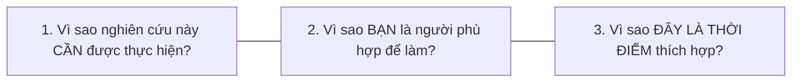

---
{"dg-publish":true,"permalink":"/knowledge/02-tech-second-brain/research-skills/mindset-read-paper/06-luu-y-cot-loi-proposal/","pinned":"false","tags":["type/howto","topic/research-method","status/stable"]}
---

# ⚠️ 5 LƯU Ý CỐT LÕI KHI VIẾT RESEARCH PROPOSAL

> **Tóm tắt:** Đề cương nghiên cứu (Research Proposal) cần thể hiện được tính khả thi, giá trị đóng góp mới và tư duy phản biện khoa học. Dưới đây là 5 bài học cốt lõi giúp bản Proposal của bạn thuyết phục hoàn toàn người phản biện và Hội đồng.

---

## 📍 1. Proposal Không Phải Là Literature Review Thuần Túy

Nhiều người dành phần lớn dung lượng đề cương chỉ để tóm tắt lại các nghiên cứu trước đó. Tuy nhiên, điều người phản biện quan tâm hàng đầu là:
* **Khoảng trống nghiên cứu (Research Gap) nằm ở đâu?**
* **Vấn đề đó tại sao vẫn còn đáng để nghiên cứu tiếp?**
* **Đề tài của bạn sẽ tạo ra đóng góp mới gì (Novelty / Contribution)?**

> 💡 **Quy tắc:** *Literature Review chỉ có giá trị khi nó làm đòn bẩy làm nổi bật lý do đề tài của bạn BẮT BUỘC phải được thực hiện.*

---

## 📍 2. Mục Tiêu Nghiên Cứu Không Phải Là Lý Do Nghiên Cứu

Nói rằng *"Tôi nghiên cứu tác động của mô hình A đến bài toán B trong bối cảnh C"* mới chỉ trả lời câu hỏi **bạn sẽ làm gì** (*What*). Một Proposal thuyết phục bắt buộc phải trả lời bổ sung:
* **Tại sao vấn đề này lại quan trọng?** (*Why it matters*)
* **Nó quan trọng với đối tượng nào?** (*Who benefits*)
* **Tại sao cần nghiên cứu ngay thời điểm hiện tại?** (*Why now*)

Chính phần lý giải này thiết lập giá trị học thuật và giá trị ứng dụng thực tiễn cho nghiên cứu của bạn.

---

## 📍 3. Methodology Không Phải Phần Viết Cho Có

Phương pháp nghiên cứu (Methodology) là thước đo trực tiếp thể hiện **tính khả thi** của toàn bộ đề tài. Một phần Methodology xuất sắc cần làm rõ:
* **Lý do lựa chọn phương pháp này** thay vì các phương pháp khác.
* **Cách xác định đối tượng, cỡ mẫu, thiết lập thực nghiệm và thu thập dữ liệu.**
* **Phương pháp xử lý & phân tích dữ liệu chi tiết.**
* **Kế hoạch triển khai và tiến độ từng giai đoạn.**

> ⚠️ *Một ý tưởng dù hay đến đâu nhưng có phần Methodology sơ sài sẽ lập tức bị Hội đồng đánh giá là thiếu tính khả thi.*

---

## 📍 4. AI Có Thể Hỗ Trợ — Nhưng Không Thay Thế Tư Duy Nghiên Cứu

Các công cụ AI (NotebookLM, ChatGPT, Gemini, Perplexity) có thể hỗ trợ rất tốt trong việc:
* Tìm kiếm và tổng hợp tài liệu tham khảo.
* Gợi ý cấu trúc dàn ý hoặc rà soát lỗi ngữ pháp/ngôn ngữ.

**Tuy nhiên:** Việc sử dụng AI để tự động tạo toàn bộ nội dung Proposal và nộp như sản phẩm của chính mình là vi phạm nghiêm trọng **nguyên tắc liêm chính học thuật (Academic Integrity)**. Người phản biện sẽ đánh giá trực tiếp khả năng giải thích, bảo vệ và phản biện ý tưởng của chính bạn.

---

## 📍 5. Viết Proposal Theo Cách Người Đọc Dễ Đánh Giá Nhất

Hội đồng phản biện thường phải đọc và đánh giá nhiều Proposal trong thời gian ngắn. Do đó, phần *Abstract*, *Introduction* và *Conclusion* phải truyền tải ngay lập tức giá trị cốt lõi bằng cách trả lời rõ 3 câu hỏi:

