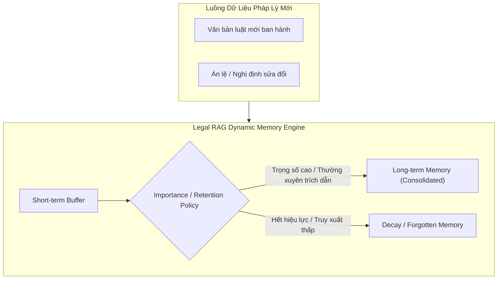
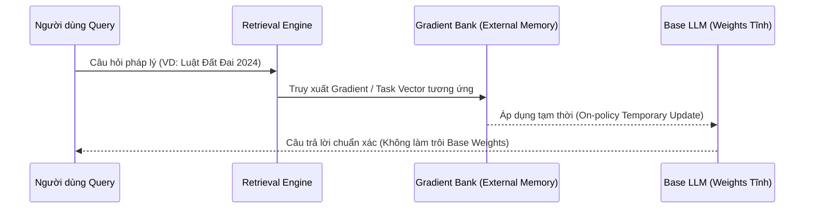

---
{"dg-publish":true,"permalink":"/knowledge/02-tech-second-brain/research-skills/mindset-read-paper/07-chien-luoc-phuong-phap-legal-ai/","pinned":"false","tags":["type/howto","topic/research-method","topic/legal-ai","topic/continual-learning","topic/rag","status/stable"]}
---

# 🚀 CHIẾN LƯỢC PHƯƠNG PHÁP NGHIÊN CỨU LEGAL AI (LLM / RAG / CONTINUAL LEARNING)

> **Tóm tắt:** Định hướng phát triển các bài báo phương pháp (Method Paper) ứng dụng cho lĩnh vực Pháp lý (Legal AI). Tập trung vào 3 hướng đi đón đầu xu hướng: **Selective Legal RAG Memory** (Cơ chế quên có chủ đích), **Semi-parametric Continual Learning** (ReGrad Gradient Bank), và **RAG-based Machine Unlearning** (Đáp ứng yêu cầu pháp lý).

---

## 🌐 Xu Hướng Tổng Quan: RAG Như Một Nhánh Continual Learning

Trong các nghiên cứu gần đây về Continual Learning (Học liên tục) cho Large Language Models (LLMs), **Retrieval-Augmented Generation (RAG)** / External Memory được xem là giải pháp cốt lõi nhằm tránh phải liên tục cập nhật trọng số parametric — từ đó triệt tiêu hiện tượng **Catastrophic Forgetting** (Quên thảm họa).

Vector store hiện nay đang dịch chuyển từ dạng "tĩnh" sang "động" (Dynamic Memory):
* **Consolidation (Củng cố):** Tăng cường các chunk dữ liệu được truy xuất nhiều hoặc có giá trị cao.
* **Decay & Selective Retention (Phân rã & Quên có chọn lọc):** Áp dụng mô hình đường cong quên (Ebbinghaus forgetting curve) để tự động nén/quên các thông tin ít quan trọng, giữ cho Index gọn nhẹ và tăng hiệu năng truy xuất NDCG.

---

## 📌 HƯỚNG 1: Selective / Cognitive Forgetting Trong RAG Pháp Lý (Khuyên dùng #1)

### 💡 Ý tưởng cốt lõi:
Xây dựng hệ thống Legal RAG Memory có cơ chế củng cố và quên tự nhiên như não bộ con người, thay vì lưu trữ phẳng tất cả các văn bản ở cùng một mức ưu tiên.

### 🏛️ Cụ thể hóa vào Miền Pháp Lý (Legal Adaptation):
Thay thế các chỉ số "cảm xúc" (emotion) trong mô hình chatbot thông thường bằng các **Trọng số Pháp lý (Legal Weight Metrics)**:
1. **Citation Graph Centrality:** Mức độ được trích dẫn/dẫn chiếu của điều luật hoặc án lệ.
2. **Thời hạn hiệu lực:** Trạng thái hiệu lực hiện hành (còn hiệu lực, bị sửa đổi, hết hiệu lực).
3. **Mức độ rủi ro & hình phạt:** Tầm quan trọng của điều luật đối với tuân thủ doanh nghiệp.

### 📊 Đánh giá (Evaluation):
* Đánh giá không chỉ theo QA Accuracy mà thêm tiêu chí **Legal Compliance**:
  * Mô hình có ưu tiên luật mới ban hành hơn luật cũ không?
  * Mô hình có xử lý được xung đột luật (Legal Conflict Resolution) không?
  * Mô hình có tránh việc "hồi tưởng" (hallucinate) các quy định đã hết hiệu lực không?

> **Đánh giá ưu điểm:** Dễ kể câu chuyện khoa học (Cognitive-inspired forgetting + Legal domain), sơ đồ kiến trúc rõ ràng, baseline chuẩn xác (Static RAG vs. Dynamic Adaptive Memory).

---

## 📌 HƯỚNG 2: Semi-Parametric Continual Learning Kiểu ReGrad Cho Pháp Lý

### 💡 Ý tưởng cốt lõi:
Thay vì chỉ lưu trữ document embeddings đơn thuần, hệ thống lưu trữ trực tiếp các **Update Signals (Gradients / Task Vectors)** tương ứng với từng văn bản luật mới vào một **Gradient Bank**.

### 🏛️ Cụ thể hóa vào Miền Pháp Lý:
* Khi có văn bản luật hoặc án lệ mới, tiền tính toán Document-specific Gradient và lưu vào Gradient Bank.
* Khi suy luận (Inference), mô hình chỉ truy xuất gradient liên quan và cập nhật **tạm thời** cho Base Model.

### 🌟 Lợi thế học thuật:
* Triệt tiêu Catastrophic Forgetting vì trọng số gốc (base weights) không bị thay đổi vĩnh viễn (zero weight drift).
* Dễ dàng bật/tắt các "Chế độ pháp lý" (Temporal Regimes) theo mốc thời gian sửa đổi luật.

---

## 📌 HƯỚNG 3: RAG-based Machine Unlearning Cho Yêu Cầu Tuân Thủ Pháp Lý

### 💡 Ý tưởng cốt lõi:
Sử dụng RAG để thực hiện hành vi **"Quên có kiểm soát" (Controlled Forgetting / Machine Unlearning)** đáp ứng các yêu cầu pháp lý như *Right to be Forgotten (Quyền được xóa dữ liệu)*, hồ sơ bị niêm phong (sealed records), hoặc thông tin bảo mật.

### 🏛️ Cụ thể hóa vào Miền Pháp Lý:
* Mô hình hóa các cấp độ xóa tri thức:
  1. **Xóa hoàn toàn:** Xóa triệt để khỏi Index.
  2. **Xóa phân quyền (Role-based Filtering):** Ẩn khỏi public nhưng duy trì cho truy cập nội bộ.
  3. **Xóa định danh (Anonymization):** Ẩn thông tin cá nhân/doanh nghiệp nhưng giữ lại lập luận pháp lý.
* Coi Unlearning như một bài toán tối ưu có ràng buộc (Constrained Optimization): Xóa sạch tri thức mục tiêu nhưng không làm ảnh hưởng đến các tri thức pháp lý liên quan khác.

---

## 📊 SO SÁNH TỔNG HỢP CÁC HƯỚNG ĐI

| Hướng nghiên cứu | Độ khó Engineering | Novelty Học Thuật | Phù hợp cho Hội nghị |
| :--- | :--- | :--- | :--- |
| **1. Selective Legal RAG Memory** | Vừa phải | Cao (Câu chuyện sắc bén) | KDD, CIKM, ACL, AI&Law |
| **2. ReGrad Continual Learning** | Phức tạp | Rất Cao (Technical depth) | NeurIPS, ICLR, ICML |
| **3. RAG Machine Unlearning** | Vừa phải | Cao (Responsible AI) | AAAI, IJCAI, FAccT |
